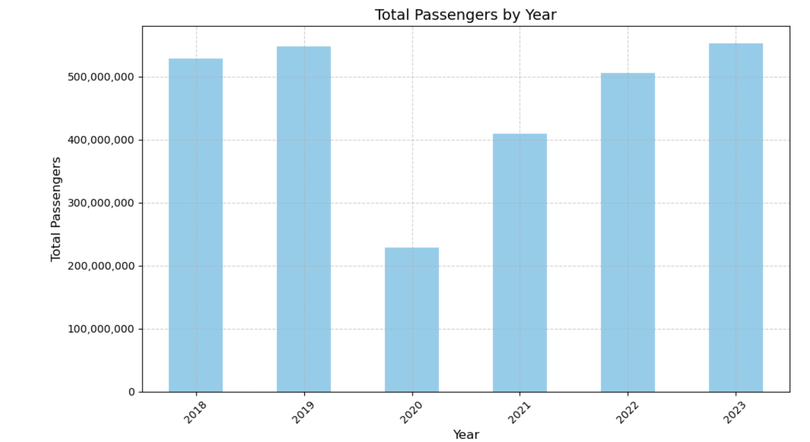
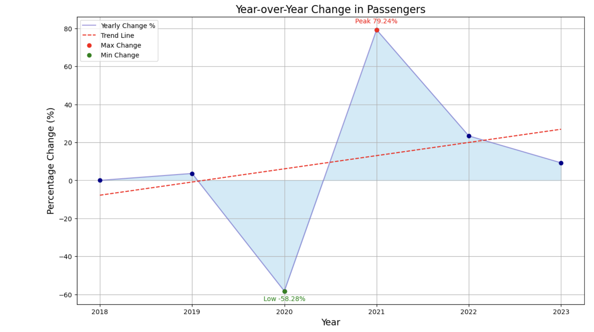
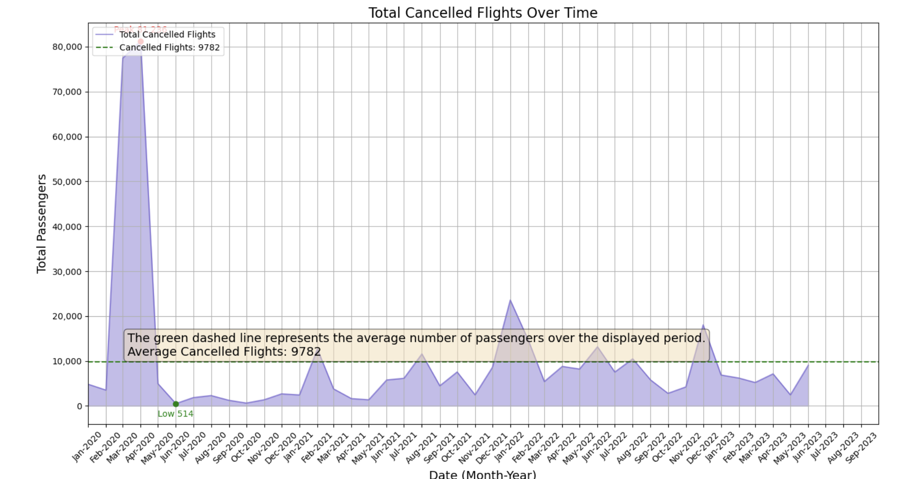
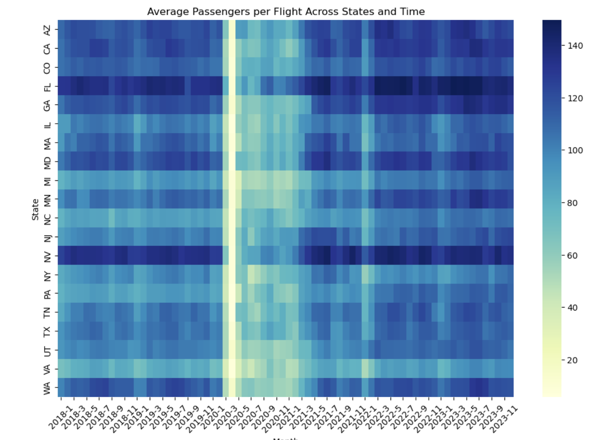

# Group_6_EDA
Group 6 Flight Data EDA project
AI Boot Camp Project 
## The Turbulent Journey: How COVID-19 Reshaped the U.S. Domestic Airline Industry
> Team Members:
> Jed Murphy, 
> Silas Philips, 
> Christoph Guenther, 
> Ava Lee

  
### Project Overview
Purpose:
The U.S. domestic airline industry experienced an unprecedented crisis due to the COVID-19 pandemic. Our analysis of flight data from January 2018 to September 2023 reveals the profound impact of the pandemic on air travel.

### Background
The COVID-19 pandemic has caused an unprecedented crisis in the U.S. domestic airline industry. Our analysis of flight data from January 2018 to September 2023 reveals the impact of the virus on air travel. As the virus spread globally in early 2020, travel restrictions and fear of infection led to a drastic decline in the number of flights and passengers. The data showcases that the enplaned passengers and flights reached record lows during the peak of the pandemic. We will also demonstrate the impact of canceled flights and the relationship between average delay and enplaned passengers. Additionally, we will provide insights into how passenger traffic has been like post-pandemic.

### Goal
The goal is to determine how Covid 19 impacted the domestic airline market.

### Questions to be addressed
How did Covid 19 impact 10 largest US airports in terms of passenger volume?
How long did it take for passenger volume to normalize after Covid 19 at the 10 largest US
airports?
Did average airfare change at the 10 largest US airports during Covid?
If it changed, when did it change as compared to when passenger volume changed?
If it changed when did average airfare normalize?
Is there a correlation between Covid19 and customer satisfaction?
Covid19 is defined by the drop off in passenger volume.
Is there a correlation between Covid19 and the number of flights?

### Overview of data collection
Data Sources: 
### $${\color{navy}Bureau of Transportation Statistics (BTS):}$$
Provides extensive data on US flights, including on-time performance, delays, cancellations, and more.   [BTS](https://www.bts.gov/topics/airlines-airports-and-aviation)

### $${\color{navy}Aviation Edge:}$$ 
Offers a suite of APIs providing access to various aviation-related data, including flight schedules, tracking, airport, and aircraft data. [AviationEdge](https://aviation-edge.com/)

### $${\color{navy}Aviationstack:}$$
Provides a powerful flight data API offering real-time and historical flight information, including tracking, status, routes, and airline details. [Aviationstack](https://aviationstack.com/)

### $${\color{navy}FAA:}$$
Offers a comprehensive dataset of airline routes, airports, and schedules freely available for download, useful for researchers and developers. [FAA](https://www.faa.gov/)

### $${\color{navy}Transportation.gov:}$$ 
Offers multiple data sets.

### Cleanup and exploration approach 

	- Clean up missing values, outliers, and duplicate data.
	- Normalize or scale numerical features for diagrams.
	- Calculate summary statistics for numerical features.
	- Explore the distribution of numerical features using histograms, box plots, or violin plots.
	- Examine the frequency distribution of categorical features using bar plots or count plots.
	- Correlate analysis to detect patterns within time series data.
	- Create geographical visualizations using maps to analyze spatial data.
	- Use advanced plotting libraries like Plotly or Seaborn for more customized visualizations.

### Result/Conclusion 

### Summary

### Problem Encountered

	* Storage issue with GitHub
	  	- GitHub has a 1G storage limitation.  The amount of data we were working with was
    	  beyond that.  So we believed that the data was corrupted, leading us to spend 
	          hours finding a solution
	* Size of dataframes for a personal machine
	* Datasets specifics are not available
	  	- Airfare information is only available by quarter
          	- All additional information is available by month
          	- To get additional information, it would cost more 

### Future Considerations
* How were these industry adjustments reflected in customer satisfaction
* Determine if areas with lighter COVID restrictions recover faster than the areas with heavier restrictions
* How this data would reflect internationally

